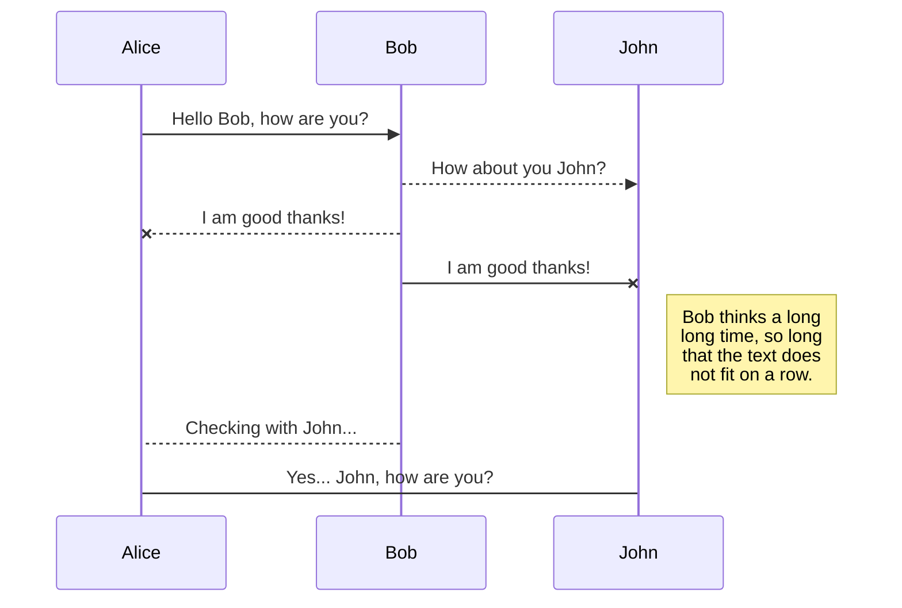
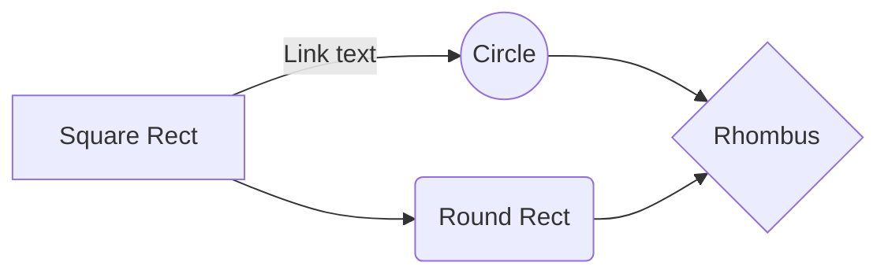

    
<!--
<a href="http://taylantatli.github.io/Moon"><b>CV</b></a> is a minimal, one column jekyll theme.
 <-->

If you like, you can download my 
<a href="https://drive.google.com/file/d/1qGlpzzfgkXpHx_l4wmmk-MRTaaJ5YK9a/view?usp=sharing"><b>CV</b></a> or view some of my work on this page.

## Hard Skills 
* Rstudio
* Python
* SQL
* Git

## Solf Skills 
* Communication 
* Analysis 
* Analytical thinking 
* Research 
* Questioning 
* Ambitious

## Professional Training 

*  **WBDS LA Pre-Camp: Bash e Git/GitHub** 20hrs 
*  **WBDS LA: Introduction to Python** 50hrs 
*  **WBDS LA: Introduction to Data Analysis with Python** 50 hrs
* **University of Michigan: Introduction to Structures Query Language (SQL)** 
*  **Núcleo de Robótica Pequi Mecâcino: Process Automation with Python** 5 hrs 

## Work Experience 

* Research student  From Childhood to Maturity:Investigating Human Development through a Psychobiological and Evolutionary Perspective  2018-2018

*  Board Biological Sciences Student Association  2018-2019 
>Responsible for attending to the academic demands of Biological Sciences students, as well as promoting extension activities and events.

*  PIBIC Theoretical Ecology and Synthesis Laboratory  2019-2020 
>Investigated evolutionary rescue and adaptive response to climate change in populations of the Micrurus lemniscatus complex. Developed skills include eco-population models, statistical analysis, data visualization, and Rstudio.

*  PIBIC Theoretical Ecology and Synthesis Laboratory  2020-2021 
>Designed experiments and collected data on evolutionary rescue and diversity in Cerrado amphibians. Developed skills include statistical analysis and scientific communication 

*  PIBIC  Theoretical Ecology and Synthesis Laboratory  2021-2022 
>Conducted on-site data collection to study the distribution and evolutionary rescue of Aedes aegypti and Aedes albopictus under climate change. Developed skills include experimental design, data management, statistical analysis using GIS and statistical software, scientific writing and communication, and knowledge of mosquito biology and ecology.

      
[Lattes Curriculum](http://lattes.cnpq.br/9326098337353690){: .btn}

## UML diagrams

You can render UML diagrams using [Mermaid](https://mermaidjs.github.io/). For example, this will produce a sequence diagram:

And this will produce a flow chart:

